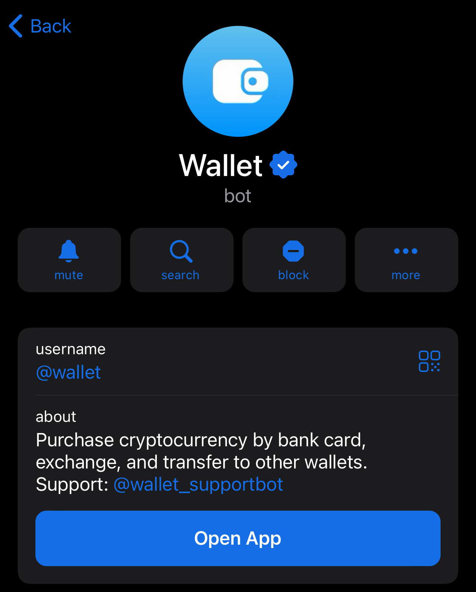
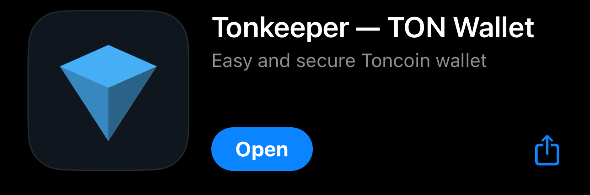

# Fundamentals

### What is Blockchain and Cryptocurrency?

A blockchain is essentially a secure and unchangeable digital database. Think of it as a huge digital ledger distributed across many computers worldwide. Each transaction is a "block" that is cryptographically linked to the previous one, forming a chain. This chain is impossible to forge or alter because copies are stored by all network participants. The TON blockchain is one of the fastest and most scalable blockchains, capable of processing millions of transactions per second.

A cryptocurrency is a digital currency that uses cryptography for transaction security and to control the creation of new units. Unlike traditional money, it is not controlled by governments or banks. TON (Toncoin) is the native cryptocurrency of the TON blockchain, used to pay transaction fees and interact with decentralized applications.

### What is a Prediction Market and How Does It Work?

A prediction market is a platform where people place bets on the outcome of future events, such as sports matches, elections, or even crypto price fluctuations. It's more than just gambling; it's a way to use collective intelligence to forecast results. On a platform like Toncast, you place a bet on one of the possible outcomes. If your prediction is correct, you receive a payout calculated based on the total betting pool and the odds.

### What is a Decentralized Application (dApp)?

A decentralized application (dApp) is an application that runs on a decentralized system (a blockchain) rather than on a single company's servers. This means a dApp has no single point of failure, is censorship-resistant, and cannot be shut down. Instead of storing data on a central server, a dApp uses smart contracts and a distributed blockchain network.

### What is a Crypto Wallet and Why Do You Need One?

A crypto wallet is a tool that allows you to store, send, and receive cryptocurrency, as well as interact with decentralized applications. It's important to understand that a wallet doesn't actually "store" your crypto. Instead, it holds your private keys—a type of digital password that gives you access to your funds on the blockchain. Without these keys, you can't perform transactions.

### How to Create a TON Wallet?

Instructions for @wallet and Tonkeeper

1. For @wallet in Telegram:
   * Open Telegram and find the official bot @wallet.

* Follow the bot's instructions to create a new wallet. It only takes a few seconds.

1. For Tonkeeper:
   * Download the Tonkeeper app from the App Store or Google Play.

* Open the app and select "Create New Wallet."
* Write down your seed phrase (24 words) and store it in a secure place. This phrase is your only way to recover access to your funds.

## [Or simply click here.](https://ton.org/en/wallets?locale=en\&pagination\[limit]=-1)
